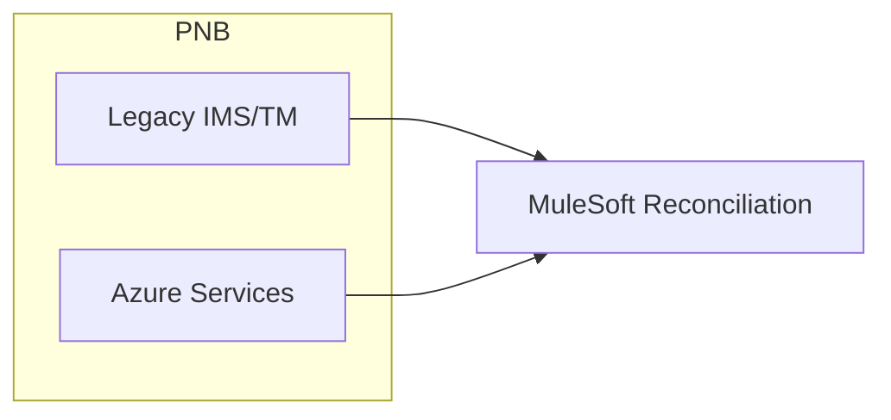

# Architecture specification — PNB / fraud (document 2302)

## Context
Post-merger hybrid core documenting fraud across legacy and Azure tiers.

## Container view

## Component responsibilities
- Component `fraud-comp-0000`: handles slice 0 of fraud posting validation, idempotency keys, and compensating transactions on PNB.
- Component `fraud-comp-0001`: handles slice 1 of fraud posting validation, idempotency keys, and compensating transactions on PNB.
- Component `fraud-comp-0002`: handles slice 2 of fraud posting validation, idempotency keys, and compensating transactions on PNB.
- Component `fraud-comp-0003`: handles slice 3 of fraud posting validation, idempotency keys, and compensating transactions on PNB.
- Component `fraud-comp-0004`: handles slice 4 of fraud posting validation, idempotency keys, and compensating transactions on PNB.
- Component `fraud-comp-0005`: handles slice 5 of fraud posting validation, idempotency keys, and compensating transactions on PNB.
- Component `fraud-comp-0006`: handles slice 6 of fraud posting validation, idempotency keys, and compensating transactions on PNB.
- Component `fraud-comp-0007`: handles slice 7 of fraud posting validation, idempotency keys, and compensating transactions on PNB.
- Component `fraud-comp-0008`: handles slice 8 of fraud posting validation, idempotency keys, and compensating transactions on PNB.
- Component `fraud-comp-0009`: handles slice 9 of fraud posting validation, idempotency keys, and compensating transactions on PNB.
- Component `fraud-comp-0010`: handles slice 10 of fraud posting validation, idempotency keys, and compensating transactions on PNB.
- Component `fraud-comp-0011`: handles slice 11 of fraud posting validation, idempotency keys, and compensating transactions on PNB.
- Component `fraud-comp-0012`: handles slice 12 of fraud posting validation, idempotency keys, and compensating transactions on PNB.
- Component `fraud-comp-0013`: handles slice 13 of fraud posting validation, idempotency keys, and compensating transactions on PNB.
- Component `fraud-comp-0014`: handles slice 14 of fraud posting validation, idempotency keys, and compensating transactions on PNB.
- Component `fraud-comp-0015`: handles slice 15 of fraud posting validation, idempotency keys, and compensating transactions on PNB.
- Component `fraud-comp-0016`: handles slice 16 of fraud posting validation, idempotency keys, and compensating transactions on PNB.
- Component `fraud-comp-0017`: handles slice 17 of fraud posting validation, idempotency keys, and compensating transactions on PNB.
- Component `fraud-comp-0018`: handles slice 18 of fraud posting validation, idempotency keys, and compensating transactions on PNB.
- Component `fraud-comp-0019`: handles slice 19 of fraud posting validation, idempotency keys, and compensating transactions on PNB.
- Component `fraud-comp-0020`: handles slice 20 of fraud posting validation, idempotency keys, and compensating transactions on PNB.
- Component `fraud-comp-0021`: handles slice 21 of fraud posting validation, idempotency keys, and compensating transactions on PNB.
- Component `fraud-comp-0022`: handles slice 22 of fraud posting validation, idempotency keys, and compensating transactions on PNB.
- Component `fraud-comp-0023`: handles slice 23 of fraud posting validation, idempotency keys, and compensating transactions on PNB.
- Component `fraud-comp-0024`: handles slice 24 of fraud posting validation, idempotency keys, and compensating transactions on PNB.
- Component `fraud-comp-0025`: handles slice 25 of fraud posting validation, idempotency keys, and compensating transactions on PNB.
- Component `fraud-comp-0026`: handles slice 26 of fraud posting validation, idempotency keys, and compensating transactions on PNB.
- Component `fraud-comp-0027`: handles slice 27 of fraud posting validation, idempotency keys, and compensating transactions on PNB.
- Component `fraud-comp-0028`: handles slice 28 of fraud posting validation, idempotency keys, and compensating transactions on PNB.
- Component `fraud-comp-0029`: handles slice 29 of fraud posting validation, idempotency keys, and compensating transactions on PNB.
- Component `fraud-comp-0030`: handles slice 30 of fraud posting validation, idempotency keys, and compensating transactions on PNB.
- Component `fraud-comp-0031`: handles slice 31 of fraud posting validation, idempotency keys, and compensating transactions on PNB.
- Component `fraud-comp-0032`: handles slice 32 of fraud posting validation, idempotency keys, and compensating transactions on PNB.
- Component `fraud-comp-0033`: handles slice 33 of fraud posting validation, idempotency keys, and compensating transactions on PNB.
- Component `fraud-comp-0034`: handles slice 34 of fraud posting validation, idempotency keys, and compensating transactions on PNB.
- Component `fraud-comp-0035`: handles slice 35 of fraud posting validation, idempotency keys, and compensating transactions on PNB.
- Component `fraud-comp-0036`: handles slice 36 of fraud posting validation, idempotency keys, and compensating transactions on PNB.
- Component `fraud-comp-0037`: handles slice 37 of fraud posting validation, idempotency keys, and compensating transactions on PNB.
- Component `fraud-comp-0038`: handles slice 38 of fraud posting validation, idempotency keys, and compensating transactions on PNB.
- Component `fraud-comp-0039`: handles slice 39 of fraud posting validation, idempotency keys, and compensating transactions on PNB.
- Component `fraud-comp-0040`: handles slice 40 of fraud posting validation, idempotency keys, and compensating transactions on PNB.
- Component `fraud-comp-0041`: handles slice 41 of fraud posting validation, idempotency keys, and compensating transactions on PNB.
- Component `fraud-comp-0042`: handles slice 42 of fraud posting validation, idempotency keys, and compensating transactions on PNB.
- Component `fraud-comp-0043`: handles slice 43 of fraud posting validation, idempotency keys, and compensating transactions on PNB.
- Component `fraud-comp-0044`: handles slice 44 of fraud posting validation, idempotency keys, and compensating transactions on PNB.
- Component `fraud-comp-0045`: handles slice 45 of fraud posting validation, idempotency keys, and compensating transactions on PNB.
- Component `fraud-comp-0046`: handles slice 46 of fraud posting validation, idempotency keys, and compensating transactions on PNB.
- Component `fraud-comp-0047`: handles slice 47 of fraud posting validation, idempotency keys, and compensating transactions on PNB.
- Component `fraud-comp-0048`: handles slice 48 of fraud posting validation, idempotency keys, and compensating transactions on PNB.
- Component `fraud-comp-0049`: handles slice 49 of fraud posting validation, idempotency keys, and compensating transactions on PNB.
- Component `fraud-comp-0050`: handles slice 50 of fraud posting validation, idempotency keys, and compensating transactions on PNB.
- Component `fraud-comp-0051`: handles slice 51 of fraud posting validation, idempotency keys, and compensating transactions on PNB.
- Component `fraud-comp-0052`: handles slice 52 of fraud posting validation, idempotency keys, and compensating transactions on PNB.
- Component `fraud-comp-0053`: handles slice 53 of fraud posting validation, idempotency keys, and compensating transactions on PNB.
- Component `fraud-comp-0054`: handles slice 54 of fraud posting validation, idempotency keys, and compensating transactions on PNB.
- Component `fraud-comp-0055`: handles slice 55 of fraud posting validation, idempotency keys, and compensating transactions on PNB.
- Component `fraud-comp-0056`: handles slice 56 of fraud posting validation, idempotency keys, and compensating transactions on PNB.
- Component `fraud-comp-0057`: handles slice 57 of fraud posting validation, idempotency keys, and compensating transactions on PNB.
- Component `fraud-comp-0058`: handles slice 58 of fraud posting validation, idempotency keys, and compensating transactions on PNB.
- Component `fraud-comp-0059`: handles slice 59 of fraud posting validation, idempotency keys, and compensating transactions on PNB.
- Component `fraud-comp-0060`: handles slice 60 of fraud posting validation, idempotency keys, and compensating transactions on PNB.
- Component `fraud-comp-0061`: handles slice 61 of fraud posting validation, idempotency keys, and compensating transactions on PNB.
- Component `fraud-comp-0062`: handles slice 62 of fraud posting validation, idempotency keys, and compensating transactions on PNB.
- Component `fraud-comp-0063`: handles slice 63 of fraud posting validation, idempotency keys, and compensating transactions on PNB.
- Component `fraud-comp-0064`: handles slice 64 of fraud posting validation, idempotency keys, and compensating transactions on PNB.
- Component `fraud-comp-0065`: handles slice 65 of fraud posting validation, idempotency keys, and compensating transactions on PNB.
- Component `fraud-comp-0066`: handles slice 66 of fraud posting validation, idempotency keys, and compensating transactions on PNB.
- Component `fraud-comp-0067`: handles slice 67 of fraud posting validation, idempotency keys, and compensating transactions on PNB.
- Component `fraud-comp-0068`: handles slice 68 of fraud posting validation, idempotency keys, and compensating transactions on PNB.
- Component `fraud-comp-0069`: handles slice 69 of fraud posting validation, idempotency keys, and compensating transactions on PNB.
- Component `fraud-comp-0070`: handles slice 70 of fraud posting validation, idempotency keys, and compensating transactions on PNB.
- Component `fraud-comp-0071`: handles slice 71 of fraud posting validation, idempotency keys, and compensating transactions on PNB.
- Component `fraud-comp-0072`: handles slice 72 of fraud posting validation, idempotency keys, and compensating transactions on PNB.
- Component `fraud-comp-0073`: handles slice 73 of fraud posting validation, idempotency keys, and compensating transactions on PNB.
- Component `fraud-comp-0074`: handles slice 74 of fraud posting validation, idempotency keys, and compensating transactions on PNB.
- Component `fraud-comp-0075`: handles slice 75 of fraud posting validation, idempotency keys, and compensating transactions on PNB.
- Component `fraud-comp-0076`: handles slice 76 of fraud posting validation, idempotency keys, and compensating transactions on PNB.
- Component `fraud-comp-0077`: handles slice 77 of fraud posting validation, idempotency keys, and compensating transactions on PNB.
- Component `fraud-comp-0078`: handles slice 78 of fraud posting validation, idempotency keys, and compensating transactions on PNB.
- Component `fraud-comp-0079`: handles slice 79 of fraud posting validation, idempotency keys, and compensating transactions on PNB.
- Component `fraud-comp-0080`: handles slice 80 of fraud posting validation, idempotency keys, and compensating transactions on PNB.
- Component `fraud-comp-0081`: handles slice 81 of fraud posting validation, idempotency keys, and compensating transactions on PNB.
- Component `fraud-comp-0082`: handles slice 82 of fraud posting validation, idempotency keys, and compensating transactions on PNB.
- Component `fraud-comp-0083`: handles slice 83 of fraud posting validation, idempotency keys, and compensating transactions on PNB.
- Component `fraud-comp-0084`: handles slice 84 of fraud posting validation, idempotency keys, and compensating transactions on PNB.
- Component `fraud-comp-0085`: handles slice 85 of fraud posting validation, idempotency keys, and compensating transactions on PNB.
- Component `fraud-comp-0086`: handles slice 86 of fraud posting validation, idempotency keys, and compensating transactions on PNB.
- Component `fraud-comp-0087`: handles slice 87 of fraud posting validation, idempotency keys, and compensating transactions on PNB.
- Component `fraud-comp-0088`: handles slice 88 of fraud posting validation, idempotency keys, and compensating transactions on PNB.
- Component `fraud-comp-0089`: handles slice 89 of fraud posting validation, idempotency keys, and compensating transactions on PNB.
- Component `fraud-comp-0090`: handles slice 90 of fraud posting validation, idempotency keys, and compensating transactions on PNB.
- Component `fraud-comp-0091`: handles slice 91 of fraud posting validation, idempotency keys, and compensating transactions on PNB.
- Component `fraud-comp-0092`: handles slice 92 of fraud posting validation, idempotency keys, and compensating transactions on PNB.
- Component `fraud-comp-0093`: handles slice 93 of fraud posting validation, idempotency keys, and compensating transactions on PNB.
- Component `fraud-comp-0094`: handles slice 94 of fraud posting validation, idempotency keys, and compensating transactions on PNB.
- Component `fraud-comp-0095`: handles slice 95 of fraud posting validation, idempotency keys, and compensating transactions on PNB.
- Component `fraud-comp-0096`: handles slice 96 of fraud posting validation, idempotency keys, and compensating transactions on PNB.
- Component `fraud-comp-0097`: handles slice 97 of fraud posting validation, idempotency keys, and compensating transactions on PNB.
- Component `fraud-comp-0098`: handles slice 98 of fraud posting validation, idempotency keys, and compensating transactions on PNB.
- Component `fraud-comp-0099`: handles slice 99 of fraud posting validation, idempotency keys, and compensating transactions on PNB.
- Component `fraud-comp-0100`: handles slice 100 of fraud posting validation, idempotency keys, and compensating transactions on PNB.
- Component `fraud-comp-0101`: handles slice 101 of fraud posting validation, idempotency keys, and compensating transactions on PNB.
- Component `fraud-comp-0102`: handles slice 102 of fraud posting validation, idempotency keys, and compensating transactions on PNB.
- Component `fraud-comp-0103`: handles slice 103 of fraud posting validation, idempotency keys, and compensating transactions on PNB.
- Component `fraud-comp-0104`: handles slice 104 of fraud posting validation, idempotency keys, and compensating transactions on PNB.
- Component `fraud-comp-0105`: handles slice 105 of fraud posting validation, idempotency keys, and compensating transactions on PNB.
- Component `fraud-comp-0106`: handles slice 106 of fraud posting validation, idempotency keys, and compensating transactions on PNB.
- Component `fraud-comp-0107`: handles slice 107 of fraud posting validation, idempotency keys, and compensating transactions on PNB.
- Component `fraud-comp-0108`: handles slice 108 of fraud posting validation, idempotency keys, and compensating transactions on PNB.
- Component `fraud-comp-0109`: handles slice 109 of fraud posting validation, idempotency keys, and compensating transactions on PNB.
- Component `fraud-comp-0110`: handles slice 110 of fraud posting validation, idempotency keys, and compensating transactions on PNB.
- Component `fraud-comp-0111`: handles slice 111 of fraud posting validation, idempotency keys, and compensating transactions on PNB.
- Component `fraud-comp-0112`: handles slice 112 of fraud posting validation, idempotency keys, and compensating transactions on PNB.
- Component `fraud-comp-0113`: handles slice 113 of fraud posting validation, idempotency keys, and compensating transactions on PNB.
- Component `fraud-comp-0114`: handles slice 114 of fraud posting validation, idempotency keys, and compensating transactions on PNB.
- Component `fraud-comp-0115`: handles slice 115 of fraud posting validation, idempotency keys, and compensating transactions on PNB.
- Component `fraud-comp-0116`: handles slice 116 of fraud posting validation, idempotency keys, and compensating transactions on PNB.
- Component `fraud-comp-0117`: handles slice 117 of fraud posting validation, idempotency keys, and compensating transactions on PNB.
- Component `fraud-comp-0118`: handles slice 118 of fraud posting validation, idempotency keys, and compensating transactions on PNB.
- Component `fraud-comp-0119`: handles slice 119 of fraud posting validation, idempotency keys, and compensating transactions on PNB.
- Component `fraud-comp-0120`: handles slice 120 of fraud posting validation, idempotency keys, and compensating transactions on PNB.
- Component `fraud-comp-0121`: handles slice 121 of fraud posting validation, idempotency keys, and compensating transactions on PNB.
- Component `fraud-comp-0122`: handles slice 122 of fraud posting validation, idempotency keys, and compensating transactions on PNB.
- Component `fraud-comp-0123`: handles slice 123 of fraud posting validation, idempotency keys, and compensating transactions on PNB.
- Component `fraud-comp-0124`: handles slice 124 of fraud posting validation, idempotency keys, and compensating transactions on PNB.
- Component `fraud-comp-0125`: handles slice 125 of fraud posting validation, idempotency keys, and compensating transactions on PNB.
- Component `fraud-comp-0126`: handles slice 126 of fraud posting validation, idempotency keys, and compensating transactions on PNB.
- Component `fraud-comp-0127`: handles slice 127 of fraud posting validation, idempotency keys, and compensating transactions on PNB.
- Component `fraud-comp-0128`: handles slice 128 of fraud posting validation, idempotency keys, and compensating transactions on PNB.
- Component `fraud-comp-0129`: handles slice 129 of fraud posting validation, idempotency keys, and compensating transactions on PNB.
- Component `fraud-comp-0130`: handles slice 130 of fraud posting validation, idempotency keys, and compensating transactions on PNB.
- Component `fraud-comp-0131`: handles slice 131 of fraud posting validation, idempotency keys, and compensating transactions on PNB.
- Component `fraud-comp-0132`: handles slice 132 of fraud posting validation, idempotency keys, and compensating transactions on PNB.
- Component `fraud-comp-0133`: handles slice 133 of fraud posting validation, idempotency keys, and compensating transactions on PNB.
- Component `fraud-comp-0134`: handles slice 134 of fraud posting validation, idempotency keys, and compensating transactions on PNB.
- Component `fraud-comp-0135`: handles slice 135 of fraud posting validation, idempotency keys, and compensating transactions on PNB.
- Component `fraud-comp-0136`: handles slice 136 of fraud posting validation, idempotency keys, and compensating transactions on PNB.
- Component `fraud-comp-0137`: handles slice 137 of fraud posting validation, idempotency keys, and compensating transactions on PNB.
- Component `fraud-comp-0138`: handles slice 138 of fraud posting validation, idempotency keys, and compensating transactions on PNB.
- Component `fraud-comp-0139`: handles slice 139 of fraud posting validation, idempotency keys, and compensating transactions on PNB.
- Component `fraud-comp-0140`: handles slice 140 of fraud posting validation, idempotency keys, and compensating transactions on PNB.
- Component `fraud-comp-0141`: handles slice 141 of fraud posting validation, idempotency keys, and compensating transactions on PNB.
- Component `fraud-comp-0142`: handles slice 142 of fraud posting validation, idempotency keys, and compensating transactions on PNB.
- Component `fraud-comp-0143`: handles slice 143 of fraud posting validation, idempotency keys, and compensating transactions on PNB.
- Component `fraud-comp-0144`: handles slice 144 of fraud posting validation, idempotency keys, and compensating transactions on PNB.
- Component `fraud-comp-0145`: handles slice 145 of fraud posting validation, idempotency keys, and compensating transactions on PNB.
- Component `fraud-comp-0146`: handles slice 146 of fraud posting validation, idempotency keys, and compensating transactions on PNB.
- Component `fraud-comp-0147`: handles slice 147 of fraud posting validation, idempotency keys, and compensating transactions on PNB.
- Component `fraud-comp-0148`: handles slice 148 of fraud posting validation, idempotency keys, and compensating transactions on PNB.
- Component `fraud-comp-0149`: handles slice 149 of fraud posting validation, idempotency keys, and compensating transactions on PNB.
- Component `fraud-comp-0150`: handles slice 150 of fraud posting validation, idempotency keys, and compensating transactions on PNB.
- Component `fraud-comp-0151`: handles slice 151 of fraud posting validation, idempotency keys, and compensating transactions on PNB.
- Component `fraud-comp-0152`: handles slice 152 of fraud posting validation, idempotency keys, and compensating transactions on PNB.
- Component `fraud-comp-0153`: handles slice 153 of fraud posting validation, idempotency keys, and compensating transactions on PNB.
- Component `fraud-comp-0154`: handles slice 154 of fraud posting validation, idempotency keys, and compensating transactions on PNB.
- Component `fraud-comp-0155`: handles slice 155 of fraud posting validation, idempotency keys, and compensating transactions on PNB.
- Component `fraud-comp-0156`: handles slice 156 of fraud posting validation, idempotency keys, and compensating transactions on PNB.
- Component `fraud-comp-0157`: handles slice 157 of fraud posting validation, idempotency keys, and compensating transactions on PNB.
- Component `fraud-comp-0158`: handles slice 158 of fraud posting validation, idempotency keys, and compensating transactions on PNB.
- Component `fraud-comp-0159`: handles slice 159 of fraud posting validation, idempotency keys, and compensating transactions on PNB.
- Component `fraud-comp-0160`: handles slice 160 of fraud posting validation, idempotency keys, and compensating transactions on PNB.
- Component `fraud-comp-0161`: handles slice 161 of fraud posting validation, idempotency keys, and compensating transactions on PNB.
- Component `fraud-comp-0162`: handles slice 162 of fraud posting validation, idempotency keys, and compensating transactions on PNB.
- Component `fraud-comp-0163`: handles slice 163 of fraud posting validation, idempotency keys, and compensating transactions on PNB.
- Component `fraud-comp-0164`: handles slice 164 of fraud posting validation, idempotency keys, and compensating transactions on PNB.
- Component `fraud-comp-0165`: handles slice 165 of fraud posting validation, idempotency keys, and compensating transactions on PNB.
- Component `fraud-comp-0166`: handles slice 166 of fraud posting validation, idempotency keys, and compensating transactions on PNB.
- Component `fraud-comp-0167`: handles slice 167 of fraud posting validation, idempotency keys, and compensating transactions on PNB.
- Component `fraud-comp-0168`: handles slice 168 of fraud posting validation, idempotency keys, and compensating transactions on PNB.
- Component `fraud-comp-0169`: handles slice 169 of fraud posting validation, idempotency keys, and compensating transactions on PNB.
- Component `fraud-comp-0170`: handles slice 170 of fraud posting validation, idempotency keys, and compensating transactions on PNB.
- Component `fraud-comp-0171`: handles slice 171 of fraud posting validation, idempotency keys, and compensating transactions on PNB.
- Component `fraud-comp-0172`: handles slice 172 of fraud posting validation, idempotency keys, and compensating transactions on PNB.
- Component `fraud-comp-0173`: handles slice 173 of fraud posting validation, idempotency keys, and compensating transactions on PNB.
- Component `fraud-comp-0174`: handles slice 174 of fraud posting validation, idempotency keys, and compensating transactions on PNB.
- Component `fraud-comp-0175`: handles slice 175 of fraud posting validation, idempotency keys, and compensating transactions on PNB.
- Component `fraud-comp-0176`: handles slice 176 of fraud posting validation, idempotency keys, and compensating transactions on PNB.
- Component `fraud-comp-0177`: handles slice 177 of fraud posting validation, idempotency keys, and compensating transactions on PNB.
- Component `fraud-comp-0178`: handles slice 178 of fraud posting validation, idempotency keys, and compensating transactions on PNB.
- Component `fraud-comp-0179`: handles slice 179 of fraud posting validation, idempotency keys, and compensating transactions on PNB.
- Component `fraud-comp-0180`: handles slice 180 of fraud posting validation, idempotency keys, and compensating transactions on PNB.
- Component `fraud-comp-0181`: handles slice 181 of fraud posting validation, idempotency keys, and compensating transactions on PNB.
- Component `fraud-comp-0182`: handles slice 182 of fraud posting validation, idempotency keys, and compensating transactions on PNB.
- Component `fraud-comp-0183`: handles slice 183 of fraud posting validation, idempotency keys, and compensating transactions on PNB.
- Component `fraud-comp-0184`: handles slice 184 of fraud posting validation, idempotency keys, and compensating transactions on PNB.
- Component `fraud-comp-0185`: handles slice 185 of fraud posting validation, idempotency keys, and compensating transactions on PNB.
- Component `fraud-comp-0186`: handles slice 186 of fraud posting validation, idempotency keys, and compensating transactions on PNB.
- Component `fraud-comp-0187`: handles slice 187 of fraud posting validation, idempotency keys, and compensating transactions on PNB.
- Component `fraud-comp-0188`: handles slice 188 of fraud posting validation, idempotency keys, and compensating transactions on PNB.
- Component `fraud-comp-0189`: handles slice 189 of fraud posting validation, idempotency keys, and compensating transactions on PNB.
- Component `fraud-comp-0190`: handles slice 190 of fraud posting validation, idempotency keys, and compensating transactions on PNB.
- Component `fraud-comp-0191`: handles slice 191 of fraud posting validation, idempotency keys, and compensating transactions on PNB.
- Component `fraud-comp-0192`: handles slice 192 of fraud posting validation, idempotency keys, and compensating transactions on PNB.
- Component `fraud-comp-0193`: handles slice 193 of fraud posting validation, idempotency keys, and compensating transactions on PNB.
- Component `fraud-comp-0194`: handles slice 194 of fraud posting validation, idempotency keys, and compensating transactions on PNB.
- Component `fraud-comp-0195`: handles slice 195 of fraud posting validation, idempotency keys, and compensating transactions on PNB.
- Component `fraud-comp-0196`: handles slice 196 of fraud posting validation, idempotency keys, and compensating transactions on PNB.
- Component `fraud-comp-0197`: handles slice 197 of fraud posting validation, idempotency keys, and compensating transactions on PNB.
- Component `fraud-comp-0198`: handles slice 198 of fraud posting validation, idempotency keys, and compensating transactions on PNB.
- Component `fraud-comp-0199`: handles slice 199 of fraud posting validation, idempotency keys, and compensating transactions on PNB.
- Component `fraud-comp-0200`: handles slice 200 of fraud posting validation, idempotency keys, and compensating transactions on PNB.
- Component `fraud-comp-0201`: handles slice 201 of fraud posting validation, idempotency keys, and compensating transactions on PNB.
- Component `fraud-comp-0202`: handles slice 202 of fraud posting validation, idempotency keys, and compensating transactions on PNB.
- Component `fraud-comp-0203`: handles slice 203 of fraud posting validation, idempotency keys, and compensating transactions on PNB.
- Component `fraud-comp-0204`: handles slice 204 of fraud posting validation, idempotency keys, and compensating transactions on PNB.
- Component `fraud-comp-0205`: handles slice 205 of fraud posting validation, idempotency keys, and compensating transactions on PNB.
- Component `fraud-comp-0206`: handles slice 206 of fraud posting validation, idempotency keys, and compensating transactions on PNB.
- Component `fraud-comp-0207`: handles slice 207 of fraud posting validation, idempotency keys, and compensating transactions on PNB.
- Component `fraud-comp-0208`: handles slice 208 of fraud posting validation, idempotency keys, and compensating transactions on PNB.
- Component `fraud-comp-0209`: handles slice 209 of fraud posting validation, idempotency keys, and compensating transactions on PNB.
- Component `fraud-comp-0210`: handles slice 210 of fraud posting validation, idempotency keys, and compensating transactions on PNB.
- Component `fraud-comp-0211`: handles slice 211 of fraud posting validation, idempotency keys, and compensating transactions on PNB.
- Component `fraud-comp-0212`: handles slice 212 of fraud posting validation, idempotency keys, and compensating transactions on PNB.
- Component `fraud-comp-0213`: handles slice 213 of fraud posting validation, idempotency keys, and compensating transactions on PNB.
- Component `fraud-comp-0214`: handles slice 214 of fraud posting validation, idempotency keys, and compensating transactions on PNB.
- Component `fraud-comp-0215`: handles slice 215 of fraud posting validation, idempotency keys, and compensating transactions on PNB.
- Component `fraud-comp-0216`: handles slice 216 of fraud posting validation, idempotency keys, and compensating transactions on PNB.
- Component `fraud-comp-0217`: handles slice 217 of fraud posting validation, idempotency keys, and compensating transactions on PNB.
- Component `fraud-comp-0218`: handles slice 218 of fraud posting validation, idempotency keys, and compensating transactions on PNB.
- Component `fraud-comp-0219`: handles slice 219 of fraud posting validation, idempotency keys, and compensating transactions on PNB.
- Component `fraud-comp-0220`: handles slice 220 of fraud posting validation, idempotency keys, and compensating transactions on PNB.
- Component `fraud-comp-0221`: handles slice 221 of fraud posting validation, idempotency keys, and compensating transactions on PNB.
- Component `fraud-comp-0222`: handles slice 222 of fraud posting validation, idempotency keys, and compensating transactions on PNB.
- Component `fraud-comp-0223`: handles slice 223 of fraud posting validation, idempotency keys, and compensating transactions on PNB.
- Component `fraud-comp-0224`: handles slice 224 of fraud posting validation, idempotency keys, and compensating transactions on PNB.
- Component `fraud-comp-0225`: handles slice 225 of fraud posting validation, idempotency keys, and compensating transactions on PNB.
- Component `fraud-comp-0226`: handles slice 226 of fraud posting validation, idempotency keys, and compensating transactions on PNB.
- Component `fraud-comp-0227`: handles slice 227 of fraud posting validation, idempotency keys, and compensating transactions on PNB.
- Component `fraud-comp-0228`: handles slice 228 of fraud posting validation, idempotency keys, and compensating transactions on PNB.
- Component `fraud-comp-0229`: handles slice 229 of fraud posting validation, idempotency keys, and compensating transactions on PNB.
- Component `fraud-comp-0230`: handles slice 230 of fraud posting validation, idempotency keys, and compensating transactions on PNB.
- Component `fraud-comp-0231`: handles slice 231 of fraud posting validation, idempotency keys, and compensating transactions on PNB.
- Component `fraud-comp-0232`: handles slice 232 of fraud posting validation, idempotency keys, and compensating transactions on PNB.
- Component `fraud-comp-0233`: handles slice 233 of fraud posting validation, idempotency keys, and compensating transactions on PNB.
- Component `fraud-comp-0234`: handles slice 234 of fraud posting validation, idempotency keys, and compensating transactions on PNB.
- Component `fraud-comp-0235`: handles slice 235 of fraud posting validation, idempotency keys, and compensating transactions on PNB.
- Component `fraud-comp-0236`: handles slice 236 of fraud posting validation, idempotency keys, and compensating transactions on PNB.
- Component `fraud-comp-0237`: handles slice 237 of fraud posting validation, idempotency keys, and compensating transactions on PNB.
- Component `fraud-comp-0238`: handles slice 238 of fraud posting validation, idempotency keys, and compensating transactions on PNB.
- Component `fraud-comp-0239`: handles slice 239 of fraud posting validation, idempotency keys, and compensating transactions on PNB.
- Component `fraud-comp-0240`: handles slice 240 of fraud posting validation, idempotency keys, and compensating transactions on PNB.
- Component `fraud-comp-0241`: handles slice 241 of fraud posting validation, idempotency keys, and compensating transactions on PNB.
- Component `fraud-comp-0242`: handles slice 242 of fraud posting validation, idempotency keys, and compensating transactions on PNB.
- Component `fraud-comp-0243`: handles slice 243 of fraud posting validation, idempotency keys, and compensating transactions on PNB.
- Component `fraud-comp-0244`: handles slice 244 of fraud posting validation, idempotency keys, and compensating transactions on PNB.
- Component `fraud-comp-0245`: handles slice 245 of fraud posting validation, idempotency keys, and compensating transactions on PNB.
- Component `fraud-comp-0246`: handles slice 246 of fraud posting validation, idempotency keys, and compensating transactions on PNB.
- Component `fraud-comp-0247`: handles slice 247 of fraud posting validation, idempotency keys, and compensating transactions on PNB.
- Component `fraud-comp-0248`: handles slice 248 of fraud posting validation, idempotency keys, and compensating transactions on PNB.
- Component `fraud-comp-0249`: handles slice 249 of fraud posting validation, idempotency keys, and compensating transactions on PNB.
- Component `fraud-comp-0250`: handles slice 250 of fraud posting validation, idempotency keys, and compensating transactions on PNB.
- Component `fraud-comp-0251`: handles slice 251 of fraud posting validation, idempotency keys, and compensating transactions on PNB.
- Component `fraud-comp-0252`: handles slice 252 of fraud posting validation, idempotency keys, and compensating transactions on PNB.
- Component `fraud-comp-0253`: handles slice 253 of fraud posting validation, idempotency keys, and compensating transactions on PNB.
- Component `fraud-comp-0254`: handles slice 254 of fraud posting validation, idempotency keys, and compensating transactions on PNB.
- Component `fraud-comp-0255`: handles slice 255 of fraud posting validation, idempotency keys, and compensating transactions on PNB.
- Component `fraud-comp-0256`: handles slice 256 of fraud posting validation, idempotency keys, and compensating transactions on PNB.
- Component `fraud-comp-0257`: handles slice 257 of fraud posting validation, idempotency keys, and compensating transactions on PNB.
- Component `fraud-comp-0258`: handles slice 258 of fraud posting validation, idempotency keys, and compensating transactions on PNB.
- Component `fraud-comp-0259`: handles slice 259 of fraud posting validation, idempotency keys, and compensating transactions on PNB.
- Component `fraud-comp-0260`: handles slice 260 of fraud posting validation, idempotency keys, and compensating transactions on PNB.
- Component `fraud-comp-0261`: handles slice 261 of fraud posting validation, idempotency keys, and compensating transactions on PNB.
- Component `fraud-comp-0262`: handles slice 262 of fraud posting validation, idempotency keys, and compensating transactions on PNB.
- Component `fraud-comp-0263`: handles slice 263 of fraud posting validation, idempotency keys, and compensating transactions on PNB.
- Component `fraud-comp-0264`: handles slice 264 of fraud posting validation, idempotency keys, and compensating transactions on PNB.
- Component `fraud-comp-0265`: handles slice 265 of fraud posting validation, idempotency keys, and compensating transactions on PNB.
- Component `fraud-comp-0266`: handles slice 266 of fraud posting validation, idempotency keys, and compensating transactions on PNB.
- Component `fraud-comp-0267`: handles slice 267 of fraud posting validation, idempotency keys, and compensating transactions on PNB.
- Component `fraud-comp-0268`: handles slice 268 of fraud posting validation, idempotency keys, and compensating transactions on PNB.
- Component `fraud-comp-0269`: handles slice 269 of fraud posting validation, idempotency keys, and compensating transactions on PNB.
- Component `fraud-comp-0270`: handles slice 270 of fraud posting validation, idempotency keys, and compensating transactions on PNB.
- Component `fraud-comp-0271`: handles slice 271 of fraud posting validation, idempotency keys, and compensating transactions on PNB.
- Component `fraud-comp-0272`: handles slice 272 of fraud posting validation, idempotency keys, and compensating transactions on PNB.
- Component `fraud-comp-0273`: handles slice 273 of fraud posting validation, idempotency keys, and compensating transactions on PNB.
- Component `fraud-comp-0274`: handles slice 274 of fraud posting validation, idempotency keys, and compensating transactions on PNB.
- Component `fraud-comp-0275`: handles slice 275 of fraud posting validation, idempotency keys, and compensating transactions on PNB.
- Component `fraud-comp-0276`: handles slice 276 of fraud posting validation, idempotency keys, and compensating transactions on PNB.
- Component `fraud-comp-0277`: handles slice 277 of fraud posting validation, idempotency keys, and compensating transactions on PNB.
- Component `fraud-comp-0278`: handles slice 278 of fraud posting validation, idempotency keys, and compensating transactions on PNB.
- Component `fraud-comp-0279`: handles slice 279 of fraud posting validation, idempotency keys, and compensating transactions on PNB.
- Component `fraud-comp-0280`: handles slice 280 of fraud posting validation, idempotency keys, and compensating transactions on PNB.
- Component `fraud-comp-0281`: handles slice 281 of fraud posting validation, idempotency keys, and compensating transactions on PNB.
- Component `fraud-comp-0282`: handles slice 282 of fraud posting validation, idempotency keys, and compensating transactions on PNB.
- Component `fraud-comp-0283`: handles slice 283 of fraud posting validation, idempotency keys, and compensating transactions on PNB.
- Component `fraud-comp-0284`: handles slice 284 of fraud posting validation, idempotency keys, and compensating transactions on PNB.
- Component `fraud-comp-0285`: handles slice 285 of fraud posting validation, idempotency keys, and compensating transactions on PNB.
- Component `fraud-comp-0286`: handles slice 286 of fraud posting validation, idempotency keys, and compensating transactions on PNB.
- Component `fraud-comp-0287`: handles slice 287 of fraud posting validation, idempotency keys, and compensating transactions on PNB.
- Component `fraud-comp-0288`: handles slice 288 of fraud posting validation, idempotency keys, and compensating transactions on PNB.
- Component `fraud-comp-0289`: handles slice 289 of fraud posting validation, idempotency keys, and compensating transactions on PNB.
- Component `fraud-comp-0290`: handles slice 290 of fraud posting validation, idempotency keys, and compensating transactions on PNB.
- Component `fraud-comp-0291`: handles slice 291 of fraud posting validation, idempotency keys, and compensating transactions on PNB.
- Component `fraud-comp-0292`: handles slice 292 of fraud posting validation, idempotency keys, and compensating transactions on PNB.
- Component `fraud-comp-0293`: handles slice 293 of fraud posting validation, idempotency keys, and compensating transactions on PNB.
- Component `fraud-comp-0294`: handles slice 294 of fraud posting validation, idempotency keys, and compensating transactions on PNB.
- Component `fraud-comp-0295`: handles slice 295 of fraud posting validation, idempotency keys, and compensating transactions on PNB.
- Component `fraud-comp-0296`: handles slice 296 of fraud posting validation, idempotency keys, and compensating transactions on PNB.
- Component `fraud-comp-0297`: handles slice 297 of fraud posting validation, idempotency keys, and compensating transactions on PNB.
- Component `fraud-comp-0298`: handles slice 298 of fraud posting validation, idempotency keys, and compensating transactions on PNB.
- Component `fraud-comp-0299`: handles slice 299 of fraud posting validation, idempotency keys, and compensating transactions on PNB.
- Component `fraud-comp-0300`: handles slice 300 of fraud posting validation, idempotency keys, and compensating transactions on PNB.
- Component `fraud-comp-0301`: handles slice 301 of fraud posting validation, idempotency keys, and compensating transactions on PNB.
- Component `fraud-comp-0302`: handles slice 302 of fraud posting validation, idempotency keys, and compensating transactions on PNB.
- Component `fraud-comp-0303`: handles slice 303 of fraud posting validation, idempotency keys, and compensating transactions on PNB.
- Component `fraud-comp-0304`: handles slice 304 of fraud posting validation, idempotency keys, and compensating transactions on PNB.
- Component `fraud-comp-0305`: handles slice 305 of fraud posting validation, idempotency keys, and compensating transactions on PNB.
- Component `fraud-comp-0306`: handles slice 306 of fraud posting validation, idempotency keys, and compensating transactions on PNB.
- Component `fraud-comp-0307`: handles slice 307 of fraud posting validation, idempotency keys, and compensating transactions on PNB.
- Component `fraud-comp-0308`: handles slice 308 of fraud posting validation, idempotency keys, and compensating transactions on PNB.
- Component `fraud-comp-0309`: handles slice 309 of fraud posting validation, idempotency keys, and compensating transactions on PNB.
- Component `fraud-comp-0310`: handles slice 310 of fraud posting validation, idempotency keys, and compensating transactions on PNB.
- Component `fraud-comp-0311`: handles slice 311 of fraud posting validation, idempotency keys, and compensating transactions on PNB.
- Component `fraud-comp-0312`: handles slice 312 of fraud posting validation, idempotency keys, and compensating transactions on PNB.
- Component `fraud-comp-0313`: handles slice 313 of fraud posting validation, idempotency keys, and compensating transactions on PNB.
- Component `fraud-comp-0314`: handles slice 314 of fraud posting validation, idempotency keys, and compensating transactions on PNB.
- Component `fraud-comp-0315`: handles slice 315 of fraud posting validation, idempotency keys, and compensating transactions on PNB.
- Component `fraud-comp-0316`: handles slice 316 of fraud posting validation, idempotency keys, and compensating transactions on PNB.
- Component `fraud-comp-0317`: handles slice 317 of fraud posting validation, idempotency keys, and compensating transactions on PNB.
- Component `fraud-comp-0318`: handles slice 318 of fraud posting validation, idempotency keys, and compensating transactions on PNB.
- Component `fraud-comp-0319`: handles slice 319 of fraud posting validation, idempotency keys, and compensating transactions on PNB.
- Component `fraud-comp-0320`: handles slice 320 of fraud posting validation, idempotency keys, and compensating transactions on PNB.
- Component `fraud-comp-0321`: handles slice 321 of fraud posting validation, idempotency keys, and compensating transactions on PNB.
- Component `fraud-comp-0322`: handles slice 322 of fraud posting validation, idempotency keys, and compensating transactions on PNB.
- Component `fraud-comp-0323`: handles slice 323 of fraud posting validation, idempotency keys, and compensating transactions on PNB.
- Component `fraud-comp-0324`: handles slice 324 of fraud posting validation, idempotency keys, and compensating transactions on PNB.
- Component `fraud-comp-0325`: handles slice 325 of fraud posting validation, idempotency keys, and compensating transactions on PNB.
- Component `fraud-comp-0326`: handles slice 326 of fraud posting validation, idempotency keys, and compensating transactions on PNB.
- Component `fraud-comp-0327`: handles slice 327 of fraud posting validation, idempotency keys, and compensating transactions on PNB.
- Component `fraud-comp-0328`: handles slice 328 of fraud posting validation, idempotency keys, and compensating transactions on PNB.
- Component `fraud-comp-0329`: handles slice 329 of fraud posting validation, idempotency keys, and compensating transactions on PNB.
- Component `fraud-comp-0330`: handles slice 330 of fraud posting validation, idempotency keys, and compensating transactions on PNB.
- Component `fraud-comp-0331`: handles slice 331 of fraud posting validation, idempotency keys, and compensating transactions on PNB.
- Component `fraud-comp-0332`: handles slice 332 of fraud posting validation, idempotency keys, and compensating transactions on PNB.
- Component `fraud-comp-0333`: handles slice 333 of fraud posting validation, idempotency keys, and compensating transactions on PNB.
- Component `fraud-comp-0334`: handles slice 334 of fraud posting validation, idempotency keys, and compensating transactions on PNB.
- Component `fraud-comp-0335`: handles slice 335 of fraud posting validation, idempotency keys, and compensating transactions on PNB.
- Component `fraud-comp-0336`: handles slice 336 of fraud posting validation, idempotency keys, and compensating transactions on PNB.
- Component `fraud-comp-0337`: handles slice 337 of fraud posting validation, idempotency keys, and compensating transactions on PNB.
- Component `fraud-comp-0338`: handles slice 338 of fraud posting validation, idempotency keys, and compensating transactions on PNB.
- Component `fraud-comp-0339`: handles slice 339 of fraud posting validation, idempotency keys, and compensating transactions on PNB.
- Component `fraud-comp-0340`: handles slice 340 of fraud posting validation, idempotency keys, and compensating transactions on PNB.
- Component `fraud-comp-0341`: handles slice 341 of fraud posting validation, idempotency keys, and compensating transactions on PNB.
- Component `fraud-comp-0342`: handles slice 342 of fraud posting validation, idempotency keys, and compensating transactions on PNB.
- Component `fraud-comp-0343`: handles slice 343 of fraud posting validation, idempotency keys, and compensating transactions on PNB.
- Component `fraud-comp-0344`: handles slice 344 of fraud posting validation, idempotency keys, and compensating transactions on PNB.
- Component `fraud-comp-0345`: handles slice 345 of fraud posting validation, idempotency keys, and compensating transactions on PNB.
- Component `fraud-comp-0346`: handles slice 346 of fraud posting validation, idempotency keys, and compensating transactions on PNB.
- Component `fraud-comp-0347`: handles slice 347 of fraud posting validation, idempotency keys, and compensating transactions on PNB.
- Component `fraud-comp-0348`: handles slice 348 of fraud posting validation, idempotency keys, and compensating transactions on PNB.
- Component `fraud-comp-0349`: handles slice 349 of fraud posting validation, idempotency keys, and compensating transactions on PNB.
- Component `fraud-comp-0350`: handles slice 350 of fraud posting validation, idempotency keys, and compensating transactions on PNB.
- Component `fraud-comp-0351`: handles slice 351 of fraud posting validation, idempotency keys, and compensating transactions on PNB.
- Component `fraud-comp-0352`: handles slice 352 of fraud posting validation, idempotency keys, and compensating transactions on PNB.
- Component `fraud-comp-0353`: handles slice 353 of fraud posting validation, idempotency keys, and compensating transactions on PNB.
- Component `fraud-comp-0354`: handles slice 354 of fraud posting validation, idempotency keys, and compensating transactions on PNB.
- Component `fraud-comp-0355`: handles slice 355 of fraud posting validation, idempotency keys, and compensating transactions on PNB.
- Component `fraud-comp-0356`: handles slice 356 of fraud posting validation, idempotency keys, and compensating transactions on PNB.
- Component `fraud-comp-0357`: handles slice 357 of fraud posting validation, idempotency keys, and compensating transactions on PNB.
- Component `fraud-comp-0358`: handles slice 358 of fraud posting validation, idempotency keys, and compensating transactions on PNB.
- Component `fraud-comp-0359`: handles slice 359 of fraud posting validation, idempotency keys, and compensating transactions on PNB.
- Component `fraud-comp-0360`: handles slice 360 of fraud posting validation, idempotency keys, and compensating transactions on PNB.
- Component `fraud-comp-0361`: handles slice 361 of fraud posting validation, idempotency keys, and compensating transactions on PNB.
- Component `fraud-comp-0362`: handles slice 362 of fraud posting validation, idempotency keys, and compensating transactions on PNB.
- Component `fraud-comp-0363`: handles slice 363 of fraud posting validation, idempotency keys, and compensating transactions on PNB.
- Component `fraud-comp-0364`: handles slice 364 of fraud posting validation, idempotency keys, and compensating transactions on PNB.
- Component `fraud-comp-0365`: handles slice 365 of fraud posting validation, idempotency keys, and compensating transactions on PNB.
- Component `fraud-comp-0366`: handles slice 366 of fraud posting validation, idempotency keys, and compensating transactions on PNB.
- Component `fraud-comp-0367`: handles slice 367 of fraud posting validation, idempotency keys, and compensating transactions on PNB.
- Component `fraud-comp-0368`: handles slice 368 of fraud posting validation, idempotency keys, and compensating transactions on PNB.
- Component `fraud-comp-0369`: handles slice 369 of fraud posting validation, idempotency keys, and compensating transactions on PNB.
- Component `fraud-comp-0370`: handles slice 370 of fraud posting validation, idempotency keys, and compensating transactions on PNB.
- Component `fraud-comp-0371`: handles slice 371 of fraud posting validation, idempotency keys, and compensating transactions on PNB.
- Component `fraud-comp-0372`: handles slice 372 of fraud posting validation, idempotency keys, and compensating transactions on PNB.
- Component `fraud-comp-0373`: handles slice 373 of fraud posting validation, idempotency keys, and compensating transactions on PNB.
- Component `fraud-comp-0374`: handles slice 374 of fraud posting validation, idempotency keys, and compensating transactions on PNB.
- Component `fraud-comp-0375`: handles slice 375 of fraud posting validation, idempotency keys, and compensating transactions on PNB.
- Component `fraud-comp-0376`: handles slice 376 of fraud posting validation, idempotency keys, and compensating transactions on PNB.
- Component `fraud-comp-0377`: handles slice 377 of fraud posting validation, idempotency keys, and compensating transactions on PNB.
- Component `fraud-comp-0378`: handles slice 378 of fraud posting validation, idempotency keys, and compensating transactions on PNB.
- Component `fraud-comp-0379`: handles slice 379 of fraud posting validation, idempotency keys, and compensating transactions on PNB.
- Component `fraud-comp-0380`: handles slice 380 of fraud posting validation, idempotency keys, and compensating transactions on PNB.
- Component `fraud-comp-0381`: handles slice 381 of fraud posting validation, idempotency keys, and compensating transactions on PNB.
- Component `fraud-comp-0382`: handles slice 382 of fraud posting validation, idempotency keys, and compensating transactions on PNB.
- Component `fraud-comp-0383`: handles slice 383 of fraud posting validation, idempotency keys, and compensating transactions on PNB.
- Component `fraud-comp-0384`: handles slice 384 of fraud posting validation, idempotency keys, and compensating transactions on PNB.
- Component `fraud-comp-0385`: handles slice 385 of fraud posting validation, idempotency keys, and compensating transactions on PNB.
- Component `fraud-comp-0386`: handles slice 386 of fraud posting validation, idempotency keys, and compensating transactions on PNB.
- Component `fraud-comp-0387`: handles slice 387 of fraud posting validation, idempotency keys, and compensating transactions on PNB.
- Component `fraud-comp-0388`: handles slice 388 of fraud posting validation, idempotency keys, and compensating transactions on PNB.
- Component `fraud-comp-0389`: handles slice 389 of fraud posting validation, idempotency keys, and compensating transactions on PNB.
- Component `fraud-comp-0390`: handles slice 390 of fraud posting validation, idempotency keys, and compensating transactions on PNB.
- Component `fraud-comp-0391`: handles slice 391 of fraud posting validation, idempotency keys, and compensating transactions on PNB.
- Component `fraud-comp-0392`: handles slice 392 of fraud posting validation, idempotency keys, and compensating transactions on PNB.
- Component `fraud-comp-0393`: handles slice 393 of fraud posting validation, idempotency keys, and compensating transactions on PNB.
- Component `fraud-comp-0394`: handles slice 394 of fraud posting validation, idempotency keys, and compensating transactions on PNB.
- Component `fraud-comp-0395`: handles slice 395 of fraud posting validation, idempotency keys, and compensating transactions on PNB.
- Component `fraud-comp-0396`: handles slice 396 of fraud posting validation, idempotency keys, and compensating transactions on PNB.
- Component `fraud-comp-0397`: handles slice 397 of fraud posting validation, idempotency keys, and compensating transactions on PNB.
- Component `fraud-comp-0398`: handles slice 398 of fraud posting validation, idempotency keys, and compensating transactions on PNB.
- Component `fraud-comp-0399`: handles slice 399 of fraud posting validation, idempotency keys, and compensating transactions on PNB.
- Component `fraud-comp-0400`: handles slice 400 of fraud posting validation, idempotency keys, and compensating transactions on PNB.
- Component `fraud-comp-0401`: handles slice 401 of fraud posting validation, idempotency keys, and compensating transactions on PNB.
- Component `fraud-comp-0402`: handles slice 402 of fraud posting validation, idempotency keys, and compensating transactions on PNB.
- Component `fraud-comp-0403`: handles slice 403 of fraud posting validation, idempotency keys, and compensating transactions on PNB.
- Component `fraud-comp-0404`: handles slice 404 of fraud posting validation, idempotency keys, and compensating transactions on PNB.
- Component `fraud-comp-0405`: handles slice 405 of fraud posting validation, idempotency keys, and compensating transactions on PNB.
- Component `fraud-comp-0406`: handles slice 406 of fraud posting validation, idempotency keys, and compensating transactions on PNB.
- Component `fraud-comp-0407`: handles slice 407 of fraud posting validation, idempotency keys, and compensating transactions on PNB.
- Component `fraud-comp-0408`: handles slice 408 of fraud posting validation, idempotency keys, and compensating transactions on PNB.
- Component `fraud-comp-0409`: handles slice 409 of fraud posting validation, idempotency keys, and compensating transactions on PNB.
- Component `fraud-comp-0410`: handles slice 410 of fraud posting validation, idempotency keys, and compensating transactions on PNB.
- Component `fraud-comp-0411`: handles slice 411 of fraud posting validation, idempotency keys, and compensating transactions on PNB.
- Component `fraud-comp-0412`: handles slice 412 of fraud posting validation, idempotency keys, and compensating transactions on PNB.
- Component `fraud-comp-0413`: handles slice 413 of fraud posting validation, idempotency keys, and compensating transactions on PNB.
- Component `fraud-comp-0414`: handles slice 414 of fraud posting validation, idempotency keys, and compensating transactions on PNB.
- Component `fraud-comp-0415`: handles slice 415 of fraud posting validation, idempotency keys, and compensating transactions on PNB.
- Component `fraud-comp-0416`: handles slice 416 of fraud posting validation, idempotency keys, and compensating transactions on PNB.
- Component `fraud-comp-0417`: handles slice 417 of fraud posting validation, idempotency keys, and compensating transactions on PNB.
- Component `fraud-comp-0418`: handles slice 418 of fraud posting validation, idempotency keys, and compensating transactions on PNB.
- Component `fraud-comp-0419`: handles slice 419 of fraud posting validation, idempotency keys, and compensating transactions on PNB.
- Component `fraud-comp-0420`: handles slice 420 of fraud posting validation, idempotency keys, and compensating transactions on PNB.
- Component `fraud-comp-0421`: handles slice 421 of fraud posting validation, idempotency keys, and compensating transactions on PNB.
- Component `fraud-comp-0422`: handles slice 422 of fraud posting validation, idempotency keys, and compensating transactions on PNB.
- Component `fraud-comp-0423`: handles slice 423 of fraud posting validation, idempotency keys, and compensating transactions on PNB.
- Component `fraud-comp-0424`: handles slice 424 of fraud posting validation, idempotency keys, and compensating transactions on PNB.
- Component `fraud-comp-0425`: handles slice 425 of fraud posting validation, idempotency keys, and compensating transactions on PNB.
- Component `fraud-comp-0426`: handles slice 426 of fraud posting validation, idempotency keys, and compensating transactions on PNB.
- Component `fraud-comp-0427`: handles slice 427 of fraud posting validation, idempotency keys, and compensating transactions on PNB.
- Component `fraud-comp-0428`: handles slice 428 of fraud posting validation, idempotency keys, and compensating transactions on PNB.
- Component `fraud-comp-0429`: handles slice 429 of fraud posting validation, idempotency keys, and compensating transactions on PNB.
- Component `fraud-comp-0430`: handles slice 430 of fraud posting validation, idempotency keys, and compensating transactions on PNB.
- Component `fraud-comp-0431`: handles slice 431 of fraud posting validation, idempotency keys, and compensating transactions on PNB.
- Component `fraud-comp-0432`: handles slice 432 of fraud posting validation, idempotency keys, and compensating transactions on PNB.
- Component `fraud-comp-0433`: handles slice 433 of fraud posting validation, idempotency keys, and compensating transactions on PNB.
- Component `fraud-comp-0434`: handles slice 434 of fraud posting validation, idempotency keys, and compensating transactions on PNB.
- Component `fraud-comp-0435`: handles slice 435 of fraud posting validation, idempotency keys, and compensating transactions on PNB.
- Component `fraud-comp-0436`: handles slice 436 of fraud posting validation, idempotency keys, and compensating transactions on PNB.
- Component `fraud-comp-0437`: handles slice 437 of fraud posting validation, idempotency keys, and compensating transactions on PNB.
- Component `fraud-comp-0438`: handles slice 438 of fraud posting validation, idempotency keys, and compensating transactions on PNB.
- Component `fraud-comp-0439`: handles slice 439 of fraud posting validation, idempotency keys, and compensating transactions on PNB.
- Component `fraud-comp-0440`: handles slice 440 of fraud posting validation, idempotency keys, and compensating transactions on PNB.
- Component `fraud-comp-0441`: handles slice 441 of fraud posting validation, idempotency keys, and compensating transactions on PNB.
- Component `fraud-comp-0442`: handles slice 442 of fraud posting validation, idempotency keys, and compensating transactions on PNB.
- Component `fraud-comp-0443`: handles slice 443 of fraud posting validation, idempotency keys, and compensating transactions on PNB.
- Component `fraud-comp-0444`: handles slice 444 of fraud posting validation, idempotency keys, and compensating transactions on PNB.
- Component `fraud-comp-0445`: handles slice 445 of fraud posting validation, idempotency keys, and compensating transactions on PNB.
- Component `fraud-comp-0446`: handles slice 446 of fraud posting validation, idempotency keys, and compensating transactions on PNB.
- Component `fraud-comp-0447`: handles slice 447 of fraud posting validation, idempotency keys, and compensating transactions on PNB.
- Component `fraud-comp-0448`: handles slice 448 of fraud posting validation, idempotency keys, and compensating transactions on PNB.
- Component `fraud-comp-0449`: handles slice 449 of fraud posting validation, idempotency keys, and compensating transactions on PNB.
- Component `fraud-comp-0450`: handles slice 450 of fraud posting validation, idempotency keys, and compensating transactions on PNB.
- Component `fraud-comp-0451`: handles slice 451 of fraud posting validation, idempotency keys, and compensating transactions on PNB.
- Component `fraud-comp-0452`: handles slice 452 of fraud posting validation, idempotency keys, and compensating transactions on PNB.
- Component `fraud-comp-0453`: handles slice 453 of fraud posting validation, idempotency keys, and compensating transactions on PNB.
- Component `fraud-comp-0454`: handles slice 454 of fraud posting validation, idempotency keys, and compensating transactions on PNB.
- Component `fraud-comp-0455`: handles slice 455 of fraud posting validation, idempotency keys, and compensating transactions on PNB.
- Component `fraud-comp-0456`: handles slice 456 of fraud posting validation, idempotency keys, and compensating transactions on PNB.
- Component `fraud-comp-0457`: handles slice 457 of fraud posting validation, idempotency keys, and compensating transactions on PNB.
- Component `fraud-comp-0458`: handles slice 458 of fraud posting validation, idempotency keys, and compensating transactions on PNB.
- Component `fraud-comp-0459`: handles slice 459 of fraud posting validation, idempotency keys, and compensating transactions on PNB.
- Component `fraud-comp-0460`: handles slice 460 of fraud posting validation, idempotency keys, and compensating transactions on PNB.
- Component `fraud-comp-0461`: handles slice 461 of fraud posting validation, idempotency keys, and compensating transactions on PNB.
- Component `fraud-comp-0462`: handles slice 462 of fraud posting validation, idempotency keys, and compensating transactions on PNB.
- Component `fraud-comp-0463`: handles slice 463 of fraud posting validation, idempotency keys, and compensating transactions on PNB.
- Component `fraud-comp-0464`: handles slice 464 of fraud posting validation, idempotency keys, and compensating transactions on PNB.
- Component `fraud-comp-0465`: handles slice 465 of fraud posting validation, idempotency keys, and compensating transactions on PNB.
- Component `fraud-comp-0466`: handles slice 466 of fraud posting validation, idempotency keys, and compensating transactions on PNB.
- Component `fraud-comp-0467`: handles slice 467 of fraud posting validation, idempotency keys, and compensating transactions on PNB.
- Component `fraud-comp-0468`: handles slice 468 of fraud posting validation, idempotency keys, and compensating transactions on PNB.
- Component `fraud-comp-0469`: handles slice 469 of fraud posting validation, idempotency keys, and compensating transactions on PNB.
- Component `fraud-comp-0470`: handles slice 470 of fraud posting validation, idempotency keys, and compensating transactions on PNB.
- Component `fraud-comp-0471`: handles slice 471 of fraud posting validation, idempotency keys, and compensating transactions on PNB.
- Component `fraud-comp-0472`: handles slice 472 of fraud posting validation, idempotency keys, and compensating transactions on PNB.
- Component `fraud-comp-0473`: handles slice 473 of fraud posting validation, idempotency keys, and compensating transactions on PNB.
- Component `fraud-comp-0474`: handles slice 474 of fraud posting validation, idempotency keys, and compensating transactions on PNB.
- Component `fraud-comp-0475`: handles slice 475 of fraud posting validation, idempotency keys, and compensating transactions on PNB.
- Component `fraud-comp-0476`: handles slice 476 of fraud posting validation, idempotency keys, and compensating transactions on PNB.
- Component `fraud-comp-0477`: handles slice 477 of fraud posting validation, idempotency keys, and compensating transactions on PNB.
- Component `fraud-comp-0478`: handles slice 478 of fraud posting validation, idempotency keys, and compensating transactions on PNB.
- Component `fraud-comp-0479`: handles slice 479 of fraud posting validation, idempotency keys, and compensating transactions on PNB.
- Component `fraud-comp-0480`: handles slice 480 of fraud posting validation, idempotency keys, and compensating transactions on PNB.
- Component `fraud-comp-0481`: handles slice 481 of fraud posting validation, idempotency keys, and compensating transactions on PNB.
- Component `fraud-comp-0482`: handles slice 482 of fraud posting validation, idempotency keys, and compensating transactions on PNB.
- Component `fraud-comp-0483`: handles slice 483 of fraud posting validation, idempotency keys, and compensating transactions on PNB.
- Component `fraud-comp-0484`: handles slice 484 of fraud posting validation, idempotency keys, and compensating transactions on PNB.
- Component `fraud-comp-0485`: handles slice 485 of fraud posting validation, idempotency keys, and compensating transactions on PNB.
- Component `fraud-comp-0486`: handles slice 486 of fraud posting validation, idempotency keys, and compensating transactions on PNB.
- Component `fraud-comp-0487`: handles slice 487 of fraud posting validation, idempotency keys, and compensating transactions on PNB.
- Component `fraud-comp-0488`: handles slice 488 of fraud posting validation, idempotency keys, and compensating transactions on PNB.
- Component `fraud-comp-0489`: handles slice 489 of fraud posting validation, idempotency keys, and compensating transactions on PNB.
- Component `fraud-comp-0490`: handles slice 490 of fraud posting validation, idempotency keys, and compensating transactions on PNB.
- Component `fraud-comp-0491`: handles slice 491 of fraud posting validation, idempotency keys, and compensating transactions on PNB.
- Component `fraud-comp-0492`: handles slice 492 of fraud posting validation, idempotency keys, and compensating transactions on PNB.
- Component `fraud-comp-0493`: handles slice 493 of fraud posting validation, idempotency keys, and compensating transactions on PNB.
- Component `fraud-comp-0494`: handles slice 494 of fraud posting validation, idempotency keys, and compensating transactions on PNB.
- Component `fraud-comp-0495`: handles slice 495 of fraud posting validation, idempotency keys, and compensating transactions on PNB.
- Component `fraud-comp-0496`: handles slice 496 of fraud posting validation, idempotency keys, and compensating transactions on PNB.
- Component `fraud-comp-0497`: handles slice 497 of fraud posting validation, idempotency keys, and compensating transactions on PNB.
- Component `fraud-comp-0498`: handles slice 498 of fraud posting validation, idempotency keys, and compensating transactions on PNB.
- Component `fraud-comp-0499`: handles slice 499 of fraud posting validation, idempotency keys, and compensating transactions on PNB.
- Component `fraud-comp-0500`: handles slice 500 of fraud posting validation, idempotency keys, and compensating transactions on PNB.
- Component `fraud-comp-0501`: handles slice 501 of fraud posting validation, idempotency keys, and compensating transactions on PNB.
- Component `fraud-comp-0502`: handles slice 502 of fraud posting validation, idempotency keys, and compensating transactions on PNB.
- Component `fraud-comp-0503`: handles slice 503 of fraud posting validation, idempotency keys, and compensating transactions on PNB.
- Component `fraud-comp-0504`: handles slice 504 of fraud posting validation, idempotency keys, and compensating transactions on PNB.
- Component `fraud-comp-0505`: handles slice 505 of fraud posting validation, idempotency keys, and compensating transactions on PNB.
- Component `fraud-comp-0506`: handles slice 506 of fraud posting validation, idempotency keys, and compensating transactions on PNB.
- Component `fraud-comp-0507`: handles slice 507 of fraud posting validation, idempotency keys, and compensating transactions on PNB.
- Component `fraud-comp-0508`: handles slice 508 of fraud posting validation, idempotency keys, and compensating transactions on PNB.
- Component `fraud-comp-0509`: handles slice 509 of fraud posting validation, idempotency keys, and compensating transactions on PNB.
- Component `fraud-comp-0510`: handles slice 510 of fraud posting validation, idempotency keys, and compensating transactions on PNB.
- Component `fraud-comp-0511`: handles slice 511 of fraud posting validation, idempotency keys, and compensating transactions on PNB.
- Component `fraud-comp-0512`: handles slice 512 of fraud posting validation, idempotency keys, and compensating transactions on PNB.
- Component `fraud-comp-0513`: handles slice 513 of fraud posting validation, idempotency keys, and compensating transactions on PNB.
- Component `fraud-comp-0514`: handles slice 514 of fraud posting validation, idempotency keys, and compensating transactions on PNB.
- Component `fraud-comp-0515`: handles slice 515 of fraud posting validation, idempotency keys, and compensating transactions on PNB.
- Component `fraud-comp-0516`: handles slice 516 of fraud posting validation, idempotency keys, and compensating transactions on PNB.
- Component `fraud-comp-0517`: handles slice 517 of fraud posting validation, idempotency keys, and compensating transactions on PNB.
- Component `fraud-comp-0518`: handles slice 518 of fraud posting validation, idempotency keys, and compensating transactions on PNB.
- Component `fraud-comp-0519`: handles slice 519 of fraud posting validation, idempotency keys, and compensating transactions on PNB.
- Component `fraud-comp-0520`: handles slice 520 of fraud posting validation, idempotency keys, and compensating transactions on PNB.
- Component `fraud-comp-0521`: handles slice 521 of fraud posting validation, idempotency keys, and compensating transactions on PNB.
- Component `fraud-comp-0522`: handles slice 522 of fraud posting validation, idempotency keys, and compensating transactions on PNB.
- Component `fraud-comp-0523`: handles slice 523 of fraud posting validation, idempotency keys, and compensating transactions on PNB.
- Component `fraud-comp-0524`: handles slice 524 of fraud posting validation, idempotency keys, and compensating transactions on PNB.
- Component `fraud-comp-0525`: handles slice 525 of fraud posting validation, idempotency keys, and compensating transactions on PNB.
- Component `fraud-comp-0526`: handles slice 526 of fraud posting validation, idempotency keys, and compensating transactions on PNB.
- Component `fraud-comp-0527`: handles slice 527 of fraud posting validation, idempotency keys, and compensating transactions on PNB.
- Component `fraud-comp-0528`: handles slice 528 of fraud posting validation, idempotency keys, and compensating transactions on PNB.
- Component `fraud-comp-0529`: handles slice 529 of fraud posting validation, idempotency keys, and compensating transactions on PNB.
- Component `fraud-comp-0530`: handles slice 530 of fraud posting validation, idempotency keys, and compensating transactions on PNB.
- Component `fraud-comp-0531`: handles slice 531 of fraud posting validation, idempotency keys, and compensating transactions on PNB.
- Component `fraud-comp-0532`: handles slice 532 of fraud posting validation, idempotency keys, and compensating transactions on PNB.
- Component `fraud-comp-0533`: handles slice 533 of fraud posting validation, idempotency keys, and compensating transactions on PNB.
- Component `fraud-comp-0534`: handles slice 534 of fraud posting validation, idempotency keys, and compensating transactions on PNB.
- Component `fraud-comp-0535`: handles slice 535 of fraud posting validation, idempotency keys, and compensating transactions on PNB.
- Component `fraud-comp-0536`: handles slice 536 of fraud posting validation, idempotency keys, and compensating transactions on PNB.
- Component `fraud-comp-0537`: handles slice 537 of fraud posting validation, idempotency keys, and compensating transactions on PNB.
- Component `fraud-comp-0538`: handles slice 538 of fraud posting validation, idempotency keys, and compensating transactions on PNB.
- Component `fraud-comp-0539`: handles slice 539 of fraud posting validation, idempotency keys, and compensating transactions on PNB.
- Component `fraud-comp-0540`: handles slice 540 of fraud posting validation, idempotency keys, and compensating transactions on PNB.
- Component `fraud-comp-0541`: handles slice 541 of fraud posting validation, idempotency keys, and compensating transactions on PNB.
- Component `fraud-comp-0542`: handles slice 542 of fraud posting validation, idempotency keys, and compensating transactions on PNB.
- Component `fraud-comp-0543`: handles slice 543 of fraud posting validation, idempotency keys, and compensating transactions on PNB.
- Component `fraud-comp-0544`: handles slice 544 of fraud posting validation, idempotency keys, and compensating transactions on PNB.
- Component `fraud-comp-0545`: handles slice 545 of fraud posting validation, idempotency keys, and compensating transactions on PNB.
- Component `fraud-comp-0546`: handles slice 546 of fraud posting validation, idempotency keys, and compensating transactions on PNB.
- Component `fraud-comp-0547`: handles slice 547 of fraud posting validation, idempotency keys, and compensating transactions on PNB.
- Component `fraud-comp-0548`: handles slice 548 of fraud posting validation, idempotency keys, and compensating transactions on PNB.
- Component `fraud-comp-0549`: handles slice 549 of fraud posting validation, idempotency keys, and compensating transactions on PNB.
- Component `fraud-comp-0550`: handles slice 550 of fraud posting validation, idempotency keys, and compensating transactions on PNB.
- Component `fraud-comp-0551`: handles slice 551 of fraud posting validation, idempotency keys, and compensating transactions on PNB.
- Component `fraud-comp-0552`: handles slice 552 of fraud posting validation, idempotency keys, and compensating transactions on PNB.
- Component `fraud-comp-0553`: handles slice 553 of fraud posting validation, idempotency keys, and compensating transactions on PNB.
- Component `fraud-comp-0554`: handles slice 554 of fraud posting validation, idempotency keys, and compensating transactions on PNB.
- Component `fraud-comp-0555`: handles slice 555 of fraud posting validation, idempotency keys, and compensating transactions on PNB.
- Component `fraud-comp-0556`: handles slice 556 of fraud posting validation, idempotency keys, and compensating transactions on PNB.
- Component `fraud-comp-0557`: handles slice 557 of fraud posting validation, idempotency keys, and compensating transactions on PNB.
- Component `fraud-comp-0558`: handles slice 558 of fraud posting validation, idempotency keys, and compensating transactions on PNB.
- Component `fraud-comp-0559`: handles slice 559 of fraud posting validation, idempotency keys, and compensating transactions on PNB.
- Component `fraud-comp-0560`: handles slice 560 of fraud posting validation, idempotency keys, and compensating transactions on PNB.
- Component `fraud-comp-0561`: handles slice 561 of fraud posting validation, idempotency keys, and compensating transactions on PNB.
- Component `fraud-comp-0562`: handles slice 562 of fraud posting validation, idempotency keys, and compensating transactions on PNB.
- Component `fraud-comp-0563`: handles slice 563 of fraud posting validation, idempotency keys, and compensating transactions on PNB.
- Component `fraud-comp-0564`: handles slice 564 of fraud posting validation, idempotency keys, and compensating transactions on PNB.
- Component `fraud-comp-0565`: handles slice 565 of fraud posting validation, idempotency keys, and compensating transactions on PNB.
- Component `fraud-comp-0566`: handles slice 566 of fraud posting validation, idempotency keys, and compensating transactions on PNB.
- Component `fraud-comp-0567`: handles slice 567 of fraud posting validation, idempotency keys, and compensating transactions on PNB.
- Component `fraud-comp-0568`: handles slice 568 of fraud posting validation, idempotency keys, and compensating transactions on PNB.
- Component `fraud-comp-0569`: handles slice 569 of fraud posting validation, idempotency keys, and compensating transactions on PNB.
- Component `fraud-comp-0570`: handles slice 570 of fraud posting validation, idempotency keys, and compensating transactions on PNB.
- Component `fraud-comp-0571`: handles slice 571 of fraud posting validation, idempotency keys, and compensating transactions on PNB.
- Component `fraud-comp-0572`: handles slice 572 of fraud posting validation, idempotency keys, and compensating transactions on PNB.
- Component `fraud-comp-0573`: handles slice 573 of fraud posting validation, idempotency keys, and compensating transactions on PNB.
- Component `fraud-comp-0574`: handles slice 574 of fraud posting validation, idempotency keys, and compensating transactions on PNB.
- Component `fraud-comp-0575`: handles slice 575 of fraud posting validation, idempotency keys, and compensating transactions on PNB.
- Component `fraud-comp-0576`: handles slice 576 of fraud posting validation, idempotency keys, and compensating transactions on PNB.
- Component `fraud-comp-0577`: handles slice 577 of fraud posting validation, idempotency keys, and compensating transactions on PNB.
- Component `fraud-comp-0578`: handles slice 578 of fraud posting validation, idempotency keys, and compensating transactions on PNB.
- Component `fraud-comp-0579`: handles slice 579 of fraud posting validation, idempotency keys, and compensating transactions on PNB.
- Component `fraud-comp-0580`: handles slice 580 of fraud posting validation, idempotency keys, and compensating transactions on PNB.
- Component `fraud-comp-0581`: handles slice 581 of fraud posting validation, idempotency keys, and compensating transactions on PNB.
- Component `fraud-comp-0582`: handles slice 582 of fraud posting validation, idempotency keys, and compensating transactions on PNB.
- Component `fraud-comp-0583`: handles slice 583 of fraud posting validation, idempotency keys, and compensating transactions on PNB.
- Component `fraud-comp-0584`: handles slice 584 of fraud posting validation, idempotency keys, and compensating transactions on PNB.
- Component `fraud-comp-0585`: handles slice 585 of fraud posting validation, idempotency keys, and compensating transactions on PNB.
- Component `fraud-comp-0586`: handles slice 586 of fraud posting validation, idempotency keys, and compensating transactions on PNB.
- Component `fraud-comp-0587`: handles slice 587 of fraud posting validation, idempotency keys, and compensating transactions on PNB.
- Component `fraud-comp-0588`: handles slice 588 of fraud posting validation, idempotency keys, and compensating transactions on PNB.
- Component `fraud-comp-0589`: handles slice 589 of fraud posting validation, idempotency keys, and compensating transactions on PNB.
- Component `fraud-comp-0590`: handles slice 590 of fraud posting validation, idempotency keys, and compensating transactions on PNB.
- Component `fraud-comp-0591`: handles slice 591 of fraud posting validation, idempotency keys, and compensating transactions on PNB.
- Component `fraud-comp-0592`: handles slice 592 of fraud posting validation, idempotency keys, and compensating transactions on PNB.
- Component `fraud-comp-0593`: handles slice 593 of fraud posting validation, idempotency keys, and compensating transactions on PNB.
- Component `fraud-comp-0594`: handles slice 594 of fraud posting validation, idempotency keys, and compensating transactions on PNB.
- Component `fraud-comp-0595`: handles slice 595 of fraud posting validation, idempotency keys, and compensating transactions on PNB.
- Component `fraud-comp-0596`: handles slice 596 of fraud posting validation, idempotency keys, and compensating transactions on PNB.
- Component `fraud-comp-0597`: handles slice 597 of fraud posting validation, idempotency keys, and compensating transactions on PNB.
- Component `fraud-comp-0598`: handles slice 598 of fraud posting validation, idempotency keys, and compensating transactions on PNB.
- Component `fraud-comp-0599`: handles slice 599 of fraud posting validation, idempotency keys, and compensating transactions on PNB.
- Component `fraud-comp-0600`: handles slice 600 of fraud posting validation, idempotency keys, and compensating transactions on PNB.
- Component `fraud-comp-0601`: handles slice 601 of fraud posting validation, idempotency keys, and compensating transactions on PNB.
- Component `fraud-comp-0602`: handles slice 602 of fraud posting validation, idempotency keys, and compensating transactions on PNB.
- Component `fraud-comp-0603`: handles slice 603 of fraud posting validation, idempotency keys, and compensating transactions on PNB.
- Component `fraud-comp-0604`: handles slice 604 of fraud posting validation, idempotency keys, and compensating transactions on PNB.
- Component `fraud-comp-0605`: handles slice 605 of fraud posting validation, idempotency keys, and compensating transactions on PNB.
- Component `fraud-comp-0606`: handles slice 606 of fraud posting validation, idempotency keys, and compensating transactions on PNB.
- Component `fraud-comp-0607`: handles slice 607 of fraud posting validation, idempotency keys, and compensating transactions on PNB.
- Component `fraud-comp-0608`: handles slice 608 of fraud posting validation, idempotency keys, and compensating transactions on PNB.
- Component `fraud-comp-0609`: handles slice 609 of fraud posting validation, idempotency keys, and compensating transactions on PNB.
- Component `fraud-comp-0610`: handles slice 610 of fraud posting validation, idempotency keys, and compensating transactions on PNB.
- Component `fraud-comp-0611`: handles slice 611 of fraud posting validation, idempotency keys, and compensating transactions on PNB.
- Component `fraud-comp-0612`: handles slice 612 of fraud posting validation, idempotency keys, and compensating transactions on PNB.
- Component `fraud-comp-0613`: handles slice 613 of fraud posting validation, idempotency keys, and compensating transactions on PNB.
- Component `fraud-comp-0614`: handles slice 614 of fraud posting validation, idempotency keys, and compensating transactions on PNB.
- Component `fraud-comp-0615`: handles slice 615 of fraud posting validation, idempotency keys, and compensating transactions on PNB.
- Component `fraud-comp-0616`: handles slice 616 of fraud posting validation, idempotency keys, and compensating transactions on PNB.
- Component `fraud-comp-0617`: handles slice 617 of fraud posting validation, idempotency keys, and compensating transactions on PNB.
- Component `fraud-comp-0618`: handles slice 618 of fraud posting validation, idempotency keys, and compensating transactions on PNB.
- Component `fraud-comp-0619`: handles slice 619 of fraud posting validation, idempotency keys, and compensating transactions on PNB.
- Component `fraud-comp-0620`: handles slice 620 of fraud posting validation, idempotency keys, and compensating transactions on PNB.
- Component `fraud-comp-0621`: handles slice 621 of fraud posting validation, idempotency keys, and compensating transactions on PNB.
- Component `fraud-comp-0622`: handles slice 622 of fraud posting validation, idempotency keys, and compensating transactions on PNB.
- Component `fraud-comp-0623`: handles slice 623 of fraud posting validation, idempotency keys, and compensating transactions on PNB.
- Component `fraud-comp-0624`: handles slice 624 of fraud posting validation, idempotency keys, and compensating transactions on PNB.
- Component `fraud-comp-0625`: handles slice 625 of fraud posting validation, idempotency keys, and compensating transactions on PNB.
- Component `fraud-comp-0626`: handles slice 626 of fraud posting validation, idempotency keys, and compensating transactions on PNB.
- Component `fraud-comp-0627`: handles slice 627 of fraud posting validation, idempotency keys, and compensating transactions on PNB.
- Component `fraud-comp-0628`: handles slice 628 of fraud posting validation, idempotency keys, and compensating transactions on PNB.
- Component `fraud-comp-0629`: handles slice 629 of fraud posting validation, idempotency keys, and compensating transactions on PNB.
- Component `fraud-comp-0630`: handles slice 630 of fraud posting validation, idempotency keys, and compensating transactions on PNB.
- Component `fraud-comp-0631`: handles slice 631 of fraud posting validation, idempotency keys, and compensating transactions on PNB.
- Component `fraud-comp-0632`: handles slice 632 of fraud posting validation, idempotency keys, and compensating transactions on PNB.
- Component `fraud-comp-0633`: handles slice 633 of fraud posting validation, idempotency keys, and compensating transactions on PNB.
- Component `fraud-comp-0634`: handles slice 634 of fraud posting validation, idempotency keys, and compensating transactions on PNB.
- Component `fraud-comp-0635`: handles slice 635 of fraud posting validation, idempotency keys, and compensating transactions on PNB.
- Component `fraud-comp-0636`: handles slice 636 of fraud posting validation, idempotency keys, and compensating transactions on PNB.
- Component `fraud-comp-0637`: handles slice 637 of fraud posting validation, idempotency keys, and compensating transactions on PNB.
- Component `fraud-comp-0638`: handles slice 638 of fraud posting validation, idempotency keys, and compensating transactions on PNB.
- Component `fraud-comp-0639`: handles slice 639 of fraud posting validation, idempotency keys, and compensating transactions on PNB.
- Component `fraud-comp-0640`: handles slice 640 of fraud posting validation, idempotency keys, and compensating transactions on PNB.
- Component `fraud-comp-0641`: handles slice 641 of fraud posting validation, idempotency keys, and compensating transactions on PNB.
- Component `fraud-comp-0642`: handles slice 642 of fraud posting validation, idempotency keys, and compensating transactions on PNB.
- Component `fraud-comp-0643`: handles slice 643 of fraud posting validation, idempotency keys, and compensating transactions on PNB.
- Component `fraud-comp-0644`: handles slice 644 of fraud posting validation, idempotency keys, and compensating transactions on PNB.
- Component `fraud-comp-0645`: handles slice 645 of fraud posting validation, idempotency keys, and compensating transactions on PNB.
- Component `fraud-comp-0646`: handles slice 646 of fraud posting validation, idempotency keys, and compensating transactions on PNB.
- Component `fraud-comp-0647`: handles slice 647 of fraud posting validation, idempotency keys, and compensating transactions on PNB.
- Component `fraud-comp-0648`: handles slice 648 of fraud posting validation, idempotency keys, and compensating transactions on PNB.
- Component `fraud-comp-0649`: handles slice 649 of fraud posting validation, idempotency keys, and compensating transactions on PNB.

## Data classification
| Field | Classification | Retention |
|-------|----------------|-----------|
| field_000 | confidential | 7 years |
| field_001 | confidential | 7 years |
| field_002 | confidential | 7 years |
| field_003 | confidential | 7 years |
| field_004 | confidential | 7 years |
| field_005 | confidential | 7 years |
| field_006 | confidential | 7 years |
| field_007 | confidential | 7 years |
| field_008 | confidential | 7 years |
| field_009 | confidential | 7 years |
| field_010 | confidential | 7 years |
| field_011 | confidential | 7 years |
| field_012 | confidential | 7 years |
| field_013 | confidential | 7 years |
| field_014 | confidential | 7 years |
| field_015 | confidential | 7 years |
| field_016 | confidential | 7 years |
| field_017 | confidential | 7 years |
| field_018 | confidential | 7 years |
| field_019 | confidential | 7 years |
| field_020 | confidential | 7 years |
| field_021 | confidential | 7 years |
| field_022 | confidential | 7 years |
| field_023 | confidential | 7 years |
| field_024 | confidential | 7 years |
| field_025 | confidential | 7 years |
| field_026 | confidential | 7 years |
| field_027 | confidential | 7 years |
| field_028 | confidential | 7 years |
| field_029 | confidential | 7 years |
| field_030 | confidential | 7 years |
| field_031 | confidential | 7 years |
| field_032 | confidential | 7 years |
| field_033 | confidential | 7 years |
| field_034 | confidential | 7 years |
| field_035 | confidential | 7 years |
| field_036 | confidential | 7 years |
| field_037 | confidential | 7 years |
| field_038 | confidential | 7 years |
| field_039 | confidential | 7 years |

## Non-functional requirements
1. Throughput target TPS-0000: 1393 sustained for fraud.
1. Throughput target TPS-0001: 1131 sustained for fraud.
1. Throughput target TPS-0002: 149 sustained for fraud.
1. Throughput target TPS-0003: 398 sustained for fraud.
1. Throughput target TPS-0004: 5985 sustained for fraud.
1. Throughput target TPS-0005: 2487 sustained for fraud.
1. Throughput target TPS-0006: 3720 sustained for fraud.
1. Throughput target TPS-0007: 3276 sustained for fraud.
1. Throughput target TPS-0008: 3160 sustained for fraud.
1. Throughput target TPS-0009: 4978 sustained for fraud.
1. Throughput target TPS-0010: 2256 sustained for fraud.
1. Throughput target TPS-0011: 3707 sustained for fraud.
1. Throughput target TPS-0012: 2204 sustained for fraud.
1. Throughput target TPS-0013: 3564 sustained for fraud.
1. Throughput target TPS-0014: 6072 sustained for fraud.
1. Throughput target TPS-0015: 7391 sustained for fraud.
1. Throughput target TPS-0016: 3554 sustained for fraud.
1. Throughput target TPS-0017: 4761 sustained for fraud.
1. Throughput target TPS-0018: 3204 sustained for fraud.
1. Throughput target TPS-0019: 5040 sustained for fraud.
1. Throughput target TPS-0020: 7801 sustained for fraud.
1. Throughput target TPS-0021: 5347 sustained for fraud.
1. Throughput target TPS-0022: 6223 sustained for fraud.
1. Throughput target TPS-0023: 1231 sustained for fraud.
1. Throughput target TPS-0024: 1355 sustained for fraud.
1. Throughput target TPS-0025: 6394 sustained for fraud.
1. Throughput target TPS-0026: 2775 sustained for fraud.
1. Throughput target TPS-0027: 4306 sustained for fraud.
1. Throughput target TPS-0028: 6423 sustained for fraud.
1. Throughput target TPS-0029: 3777 sustained for fraud.
1. Throughput target TPS-0030: 7808 sustained for fraud.
1. Throughput target TPS-0031: 3959 sustained for fraud.
1. Throughput target TPS-0032: 4608 sustained for fraud.
1. Throughput target TPS-0033: 710 sustained for fraud.
1. Throughput target TPS-0034: 2167 sustained for fraud.
1. Throughput target TPS-0035: 7192 sustained for fraud.
1. Throughput target TPS-0036: 6790 sustained for fraud.
1. Throughput target TPS-0037: 5856 sustained for fraud.
1. Throughput target TPS-0038: 4007 sustained for fraud.
1. Throughput target TPS-0039: 6866 sustained for fraud.
1. Throughput target TPS-0040: 1612 sustained for fraud.
1. Throughput target TPS-0041: 5121 sustained for fraud.
1. Throughput target TPS-0042: 3793 sustained for fraud.
1. Throughput target TPS-0043: 912 sustained for fraud.
1. Throughput target TPS-0044: 3232 sustained for fraud.
1. Throughput target TPS-0045: 347 sustained for fraud.
1. Throughput target TPS-0046: 4695 sustained for fraud.
1. Throughput target TPS-0047: 1009 sustained for fraud.
1. Throughput target TPS-0048: 1164 sustained for fraud.
1. Throughput target TPS-0049: 6236 sustained for fraud.
1. Throughput target TPS-0050: 3816 sustained for fraud.
1. Throughput target TPS-0051: 227 sustained for fraud.
1. Throughput target TPS-0052: 642 sustained for fraud.
1. Throughput target TPS-0053: 881 sustained for fraud.
1. Throughput target TPS-0054: 1502 sustained for fraud.
1. Throughput target TPS-0055: 1513 sustained for fraud.
1. Throughput target TPS-0056: 2583 sustained for fraud.
1. Throughput target TPS-0057: 6808 sustained for fraud.
1. Throughput target TPS-0058: 3154 sustained for fraud.
1. Throughput target TPS-0059: 371 sustained for fraud.
