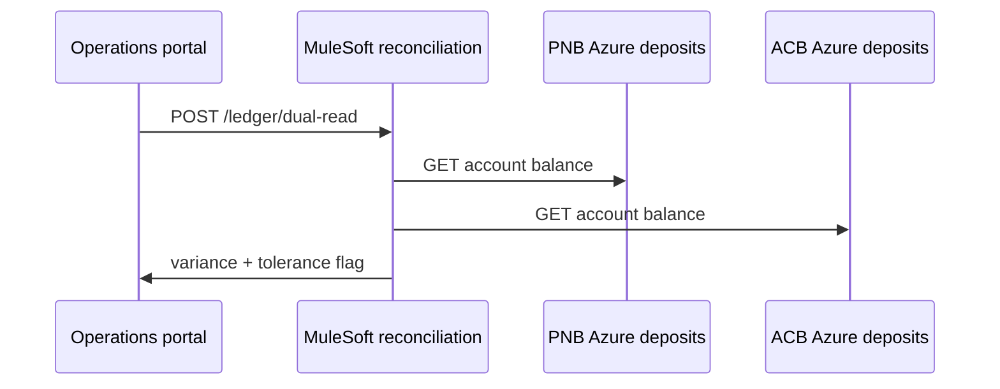

# PNB + ACB Merger Architecture

Pacific National Bank (PNB) acquired Atlantic Commerce Bank (ACB) in 2024. The combined enterprise operates a **hybrid core** with **full functional mirror** across legacy stacks and **Azure** modernisation paths for each bank brand.

## Banks and technology stacks

| Bank | Legacy online | Legacy data | Modern (Azure) |
|------|---------------|-------------|----------------|
| **PNB** | COBOL + IMS/TM | IMS/DB + DB2 (`PNBCORE`) | Spring Boot services, Azure SQL, Service Bus |
| **ACB** | PL/I + IMS/TM | IMS/DB + DB2 (`ACBCORE`) | Spring Boot services, Azure SQL, Service Bus |

## Merger reconciliation (MuleSoft)

MuleSoft is **not** the primary channel gateway. It implements the **merger reconciliation layer**:

- Customer deduplication (`POST /v1/customers/dedup`)
- Cross-bank account product mapping (`POST /v1/accounts/mapping`)
- Dual-ledger reads with variance (`POST /v1/ledger/dual-read`)

Implementation: `platform/mulesoft/apps/acb-pnb-reconciliation/`

## Domain mirror

Every canonical domain in `platform/shared/domains/DOMAIN_CATALOG.md` has:

1. PNB COBOL online program under `pnb/legacy/cobol/programs/online/`
2. ACB PL/I online program under `acb/legacy/pli/programs/online/`
3. Azure service modules under each bank’s `azure/services/`
4. DB2 artefacts under `db/pnb/db2` and `db/acb/db2`

## Request flow (dual-read example)

## Azure landing zone

Infrastructure-as-code lives under:

- `pnb/azure/infrastructure/bicep/`
- `acb/azure/infrastructure/bicep/`

Shared observability patterns: `platform/shared/observability/`
